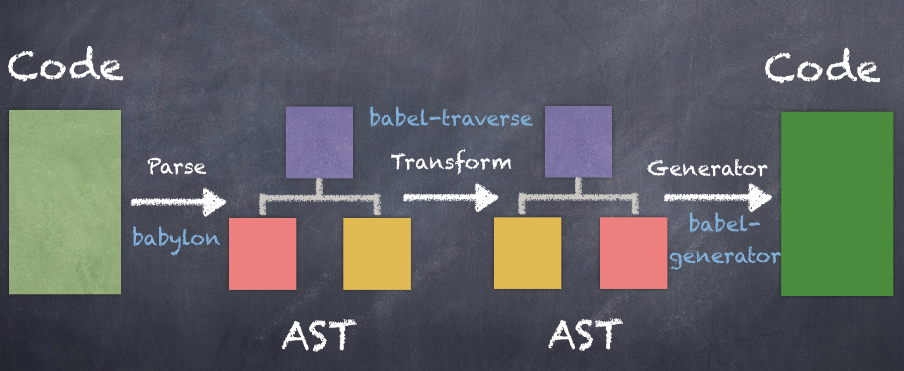

# babel-plugin-import  
- babel 的编译解析过程  
parse -> transform -> generate  


```js
<div>
  <p></p>
</div>
```
- parse 解析 (使用 babylon 生成 AST)  
  把代码 code 变成抽象语法树 AST  
  - 词法分析：状态机，把源码解析成一个个的 token：div p  
  - 语法分析：html -> DOM 树 父子关系构造出来  

```js
{
  tag: 'div',
  children: [
    {
      tag: 'p'
    }
  ]
}
```

- transform 转换  
  babel 插件就在这里起作用  

```js
while(true) {}
try {
  var a = 1
} catch (err) {

}
```
简单 AST:　
```js
body: [
  while: {
    condition: true,
    statement: null
  }
  try: {
    var: {
      variable: 'a',
      value: 1
    }
    catch: {
      argument: err
    }
  }
  
]
```